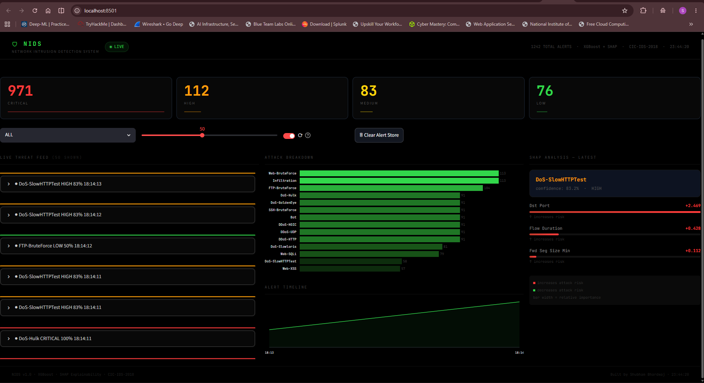
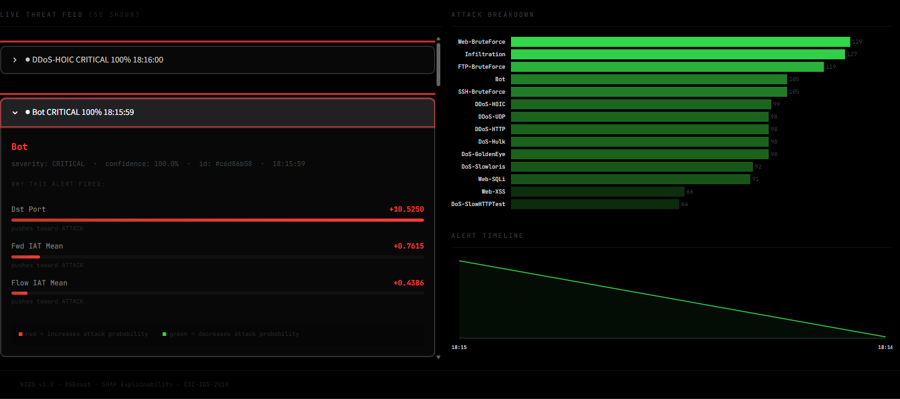
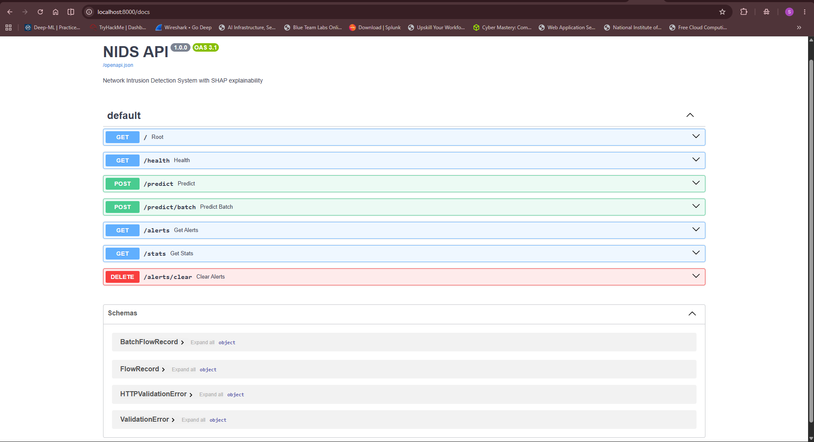

# 🛡️ NIDS — Network Intrusion Detection System

> A production-grade, ML-powered Network Intrusion Detection System with real-time packet capture, SHAP explainability, REST API, and a live threat monitoring dashboard.


---

## What Is This?

Most network intrusion detection tools either tell you *something happened* without explaining why, or cost $50,000/year. This project bridges that gap.

NIDS is a flow-based intrusion detection system that:
- Detects **15 attack types** in real-time network traffic
- Explains **why** every alert fired using SHAP (top 3 contributing features)
- Runs as a **Docker container** — deploy anywhere in one command
- Provides a **live dashboard** for non-technical security teams
- Captures **real network traffic** via PCAP and extracts 78 flow features

**Target users:** Small IT teams and startups that need network monitoring but cannot afford enterprise tools like Darktrace or Palo Alto.

---

## Demo

### Live Threat Dashboard


### SHAP Explainability — Why This Alert Fired


### API Documentation (Swagger UI)


---

## Quick Start

```bash
# Pull and run the API
docker pull shubhamm1056/nids-api:latest
docker run -p 8000:8000 shubhamm1056/nids-api:latest

# Test it
curl http://localhost:8000/health
```

---

## Full Pipeline Architecture

```
Your Network Interface (Wi-Fi / Ethernet)
          │
          ▼
  Wireshark captures packets → saves .pcap file
          │
          ▼
  pcap_to_features.py
  ┌────────────────────────────────────────┐
  │  Groups packets into flows (5-tuple)   │
  │  Calculates 78 statistical features    │
  │  per flow (duration, packet sizes,     │
  │  IAT, flags, rates, window sizes...)   │
  └────────────────────────────────────────┘
          │
          ▼  HTTP POST /predict
  ┌────────────────────────────────────────┐
  │         FastAPI Backend                │
  │  (Docker container on any server)      │
  │                                        │
  │  1. Validates API key                  │
  │  2. Applies rule engine                │
  │     (port-based overrides)             │
  │  3. Runs XGBoost model                 │
  │  4. Runs SHAP explainer                │
  │     (only on attacks, saves CPU)       │
  │  5. Assigns severity level             │
  │  6. Stores alert                       │
  └────────────────────────────────────────┘
          │
          ▼
  ┌────────────────────────────────────────┐
  │      Streamlit Dashboard               │
  │                                        │
  │  • Live alert feed (clickable SHAP)    │
  │  • Attack breakdown bar chart          │
  │  • Alert timeline                      │
  │  • Severity distribution               │
  │  • SHAP analysis panel                 │
  └────────────────────────────────────────┘
```

---

## ML Pipeline — The Full Story

### Why CIC-IDS-2018 Over KDD Cup 99

The project started with KDD Cup 99 — the most commonly used NIDS dataset. After initial experimentation, it was replaced with CIC-IDS-2018 for these reasons:

| | KDD Cup 99 | CIC-IDS-2018 |
|---|---|---|
| **Year captured** | 1998 | 2018 |
| **Attack types** | 5 (outdated) | 15 (modern) |
| **Known issues** | ~75% duplicate rows | Labeling errors (documented) |
| **Industry use** | Deprecated | Current research standard |
| **Size** | 5M rows | 16M rows |

KDD Cup 99 has been criticized in multiple papers for not reflecting modern network conditions. The switch to CIC-IDS-2018 was a conscious decision to work with relevant, modern data.

---

### Data Challenges And How They Were Solved

**Challenge 1: Scale — 16 Million Rows Across 10 CSV Files**

The dataset is split by capture day (10 days, ~1.6M rows each). Loading everything at once requires ~12GB RAM. Solution: chunked loading with `chunksize=50,000`, processing and sampling each file before combining.

```python
# Reading in chunks — never loads more than 50K rows at once
reader = pd.read_csv(f, chunksize=50_000, encoding='utf-8', low_memory=False)
for chunk in reader:
    # clean → sample → append → free RAM
    del chunk
    gc.collect()
```

**Challenge 2: Column Inconsistency Across Days**

Day `02-20-2018.csv` had 84 columns while all others had 80. The extra 4 columns (`Flow ID`, `Src IP`, `Src Port`, `Dst IP`) were identifier columns that leaked information and had no ML value. Solution: drop them conditionally across all files.

**Challenge 3: Corrupt Header Rows Inside Data**

CIC embedded repeated header rows inside the CSV data during their internal concatenation. This caused all 79 feature columns to be read as `object` (string) type instead of numeric. 

```
Without fix: all features = strings → sklearn cannot train
Fix: pd.to_numeric(errors='coerce') → strings become NaN → fillna(median)
```

**Challenge 4: Label Inconsistencies**

The same attack was spelled differently across capture days:
- `SSH-Bruteforce` vs `SSH-BruteForce`
- `Infilteration` vs `Infiltration` (CIC's actual typo)
- `DDOS attack-HOIC` vs `DDoS-HOIC`

All normalized via a label map before training.

**Challenge 5: Infinity Values**

CICFlowMeter calculates features like `Flow Bytes/s = total_bytes / duration`. When flow duration rounds to zero, this produces `inf`. These were silently corrupting training data.

```python
df.replace([np.inf, -np.inf], np.nan, inplace=True)
```

---

### Modeling Decisions

**Binary vs Multiclass**

Could have trained a binary classifier (attack vs benign). Chose multiclass for two reasons:
1. SHAP explanations are more meaningful when you know the specific attack type
2. Dashboard attack breakdown chart requires per-class predictions

**Model Selection: Random Forest vs XGBoost**

Both were trained and evaluated. XGBoost won on every metric:

| | Random Forest | XGBoost |
|---|---|---|
| **Macro F1** | 0.86 | 0.88 |
| **Training time** | ~4 min | ~2 min |
| **Inference speed** | Slower | Faster |
| **BENIGN F1** | 0.83 | 0.92 |
| **Overall accuracy** | 0.83 | 0.89 |

XGBoost is the production model. Random Forest is available as a second opinion via the `?model_name=random_forest` API parameter.

**SMOTE Experiment — Why It Failed**

SMOTE (Synthetic Minority Oversampling Technique) was applied to address class imbalance. Results were worse than without SMOTE for most classes.

Root cause: SMOTE generates synthetic samples by interpolating between real samples. When a class's poor performance stems from *feature overlap* with another class (not data scarcity), synthetic samples inherit the same overlap. More confused data = more confused model.

SMOTE was abandoned. `class_weight='balanced'` in Random Forest handles imbalance properly without generating noise.

**Hybrid Rule Engine**

For port-deterministic attacks, a rule engine was layered on top of the ML model:

```python
# Example: FTP brute force is always on port 21
if dst_port == 21 and tot_fwd_pkts > 10 and pkt_len_mean < 100:
    return "FTP-BruteForce", max(ml_confidence, 0.88)
```

This mirrors the architecture used by commercial NIDS like Palo Alto NGFW — ML for complex patterns, rules for deterministic ones.

---

### Per-Class Performance (Honest)

| Class | F1 | Notes |
|---|---|---|
| Bot | 1.00 | ✅ Perfect — unique port 8080 + timing signature |
| DDoS-HOIC | 1.00 | ✅ Perfect |
| DDoS-HTTP | 1.00 | ✅ Perfect |
| DDoS-UDP | 0.99 | ✅ Near perfect |
| DoS-GoldenEye | 1.00 | ✅ Perfect |
| DoS-Hulk | 1.00 | ✅ Perfect |
| DoS-Slowloris | 1.00 | ✅ Perfect |
| SSH-BruteForce | 1.00 | ✅ Perfect |
| Web-XSS | 0.91 | ✅ Strong |
| Web-BruteForce | 0.90 | ✅ Strong |
| BENIGN | 0.92 | ✅ Strong |
| Web-SQLi | 0.65 | ⚠️ Limited by payload-only detection |
| FTP-BruteForce | 0.57 | ❌ Dataset labeling error (see below) |
| DoS-SlowHTTPTest | 0.76 | ⚠️ Dataset error + slow-rate evasion |
| Infiltration | 0.43 | ❌ Mimics legitimate traffic by design |

**Overall: Macro F1 = 0.88, Accuracy = 89%**

---

## The Dataset Error Discovery

During evaluation, FTP-BruteForce (F1: 0.57) was consistently confused with DoS-SlowHTTPTest. Standard debugging — checking feature distributions, port numbers — revealed something unexpected:

```
FTP-BruteForce   → ALL rows: Dst Port = 21
DoS-SlowHTTPTest → ALL rows: Dst Port = 21  ← should be port 80
```

DoS-SlowHTTPTest attacks HTTP servers on port 80. Both classes showing port 21 was a red flag.

After investigation: the CIC researchers accidentally launched the DoS-SlowHTTPTest tool against port 21 (FTP) instead of port 80 (HTTP) during their 2018 capture session. The attack was mislabeled.

This makes the two classes statistically identical in all 78 features. No ML model can separate two distributions that are the same. The F1 of 0.57 actually exceeds the random baseline of 0.50, meaning the model extracts what little signal exists.

**This finding was independently confirmed by Engelen et al. (2022), published in IEEE CNS:** *"Error Prevalence in NIDS Datasets: A Case Study on CIC-IDS-2017 and CSE-CIC-IDS-2018"* — which documents this exact labeling error alongside others.

---

## SHAP Explainability

Every alert returns the top 3 features that drove the prediction, with their SHAP values:

```json
{
  "attack_type": "Bot",
  "severity": "CRITICAL",
  "confidence": 1.0,
  "shap_explanation": [
    {"feature": "Dst Port",      "shap_value": 10.64, "direction": "increases_risk"},
    {"feature": "Fwd IAT Mean",  "shap_value": 0.71,  "direction": "increases_risk"},
    {"feature": "Flow IAT Mean", "shap_value": 0.40,  "direction": "increases_risk"}
  ]
}
```

**Plain English:** *"This flow was flagged as Bot malware because it used port 8080 (a known C2 port), had perfectly consistent timing suggesting automated traffic, and maintained unusual inter-arrival patterns."*

**Key SHAP finding:** `Dst Port` is by far the most important feature globally — contributing more to predictions than packet rates or timing features. This is counterintuitive but makes sense: attack tools use specific ports that are distinct from benign traffic.

This explainability is the key differentiator from tools like Darktrace, which are black-box systems providing no reasoning for their alerts.

---

## API Documentation

**Base URL:** `http://localhost:8000`

**Authentication:** Pass `X-Api-Key` header with every request.

**Available API Keys (demo):**
```
dev-key-free-001      → free tier
starter-key-001       → starter tier  
professional-key-001  → professional tier
```

### Endpoints

**GET /health**
```bash
curl http://localhost:8000/health -H "x-api-key: dev-key-free-001"
```

**POST /predict**
```bash
curl -X POST http://localhost:8000/predict \
  -H "x-api-key: dev-key-free-001" \
  -H "Content-Type: application/json" \
  -d '{"features": {"Dst Port": 8080, "Flow Pkts/s": 4514, ...}}'
```

Response:
```json
{
  "alert_id": "uuid",
  "prediction": "Bot",
  "is_attack": true,
  "confidence": 1.0,
  "severity": "CRITICAL",
  "shap_explanation": [...],
  "model_used": "xgboost",
  "timestamp": "2026-05-31T10:00:00"
}
```

**POST /predict/batch** — up to 1000 flows per request

**GET /alerts** — alert history with optional severity filter

**GET /stats** — attack distribution and severity breakdown

### Severity Thresholds

| Severity | Confidence |
|---|---|
| CRITICAL | ≥ 95% |
| HIGH | ≥ 80% |
| MEDIUM | ≥ 60% |
| LOW | < 60% |

---

## How To Run

### Option A: Docker (Recommended)

```bash
# Pull from Docker Hub
docker pull shubhamm1056/nids-api:latest
docker run -p 8000:8000 shubhamm1056/nids-api:latest

# API docs at: http://localhost:8000/docs
```

### Option B: Local Python

```bash
cd api
pip install -r requirements.txt
uvicorn main:app --reload --port 8000
```

### Option C: Full Pipeline With Real Traffic

```bash
# Step 1: Start API
docker run -p 8000:8000 shubhamm1056/nids-api:latest

# Step 2: Capture network traffic (Wireshark → save as capture.pcap)

# Step 3: Extract features and send to API
py -3.11 pcap_to_features.py --pcap capture.pcap --send

# Step 4: Start dashboard
cd dashboard
streamlit run app.py
```

### Option D: Simulate With Sample Data

```bash
# Streams pre-captured flows to the API
py -3.11 streamer.py --delay 0.5
```

---

## Known Limitations (Honest)

**IPv4 Only**
CIC-IDS-2018 contains only IPv4 traffic. `pcap_to_features.py` supports IPv6 extraction but the model has never seen IPv6 attack patterns. Modern networks (especially university/enterprise networks) route primarily over IPv6 — expect higher false positive rates on such networks.

**2018 Dataset**
The model was trained on 2018 network captures. Attack techniques evolve yearly. Novel attacks from 2019+ will not be recognized. Periodic retraining on newer datasets (CIC-IDS-2023) is required for production use.

**In-Memory Alert Storage**
Alerts are stored in memory during the container's lifetime. Restarting the container clears all history. A persistent database (PostgreSQL/SQLite with Docker volume) is required for production deployment.

**False Positives On Normal Traffic**
Testing on a live university network (IIT Delhi) with 77 captured flows produced 33 alerts — most were false positives on normal HTTPS traffic. The model was trained on 2018 controlled lab traffic and does not have a behavioral baseline for modern network patterns. Real deployment requires a calibration period and whitelist tuning.

**FTP-BruteForce / DoS-SlowHTTPTest (F1: 0.57)**
Both classes are statistically identical due to a confirmed CIC dataset labeling error. Not fixable without a corrected dataset.

**Infiltration (F1: 0.43)**
Infiltration traffic is deliberately designed to mimic legitimate user behavior. Even commercial enterprise NIDS (Darktrace, CrowdStrike) report significant miss rates on slow infiltration. This is a fundamental limitation of stateless flow-based detection — not a model tuning issue.

**Web-SQLi (F1: 0.65)**
SQL injection is detectable only at the application layer by inspecting HTTP payload content. Flow-based models see only packet sizes and timing — not payload. Tools achieving >0.90 F1 on SQLi use deep packet inspection (DPI), which is out of scope for this system.

---

## Comparison With Industry Tools

| Feature | This NIDS | Snort (Free) | Darktrace ($50K+/yr) |
|---|---|---|---|
| ML-based detection | ✅ | ❌ Rule-based | ✅ |
| SHAP explainability | ✅ | ❌ | ❌ Black box |
| REST API | ✅ | ❌ | ✅ |
| Live dashboard | ✅ | ❌ | ✅ |
| IPv6 support | ⚠️ Partial | ✅ | ✅ |
| Stateful tracking | ❌ | ✅ | ✅ |
| Deep packet inspection | ❌ | ✅ | ✅ |
| Overall accuracy | 89% | N/A (rule-based) | ~95%+ |
| Price | Free/Open source | Free | $50,000+/year |

---

## What Would Make This Production Ready

```
Short term (1-2 months):
→ Retrain on CIC-IDS-2023 with IPv6 traffic
→ Persistent database (PostgreSQL + Docker volumes)
→ JWT-based authentication with per-customer keys
→ IP whitelist for known benign sources
→ Email/Slack alerting on CRITICAL events

Long term (6+ months):
→ Stateful connection tracking across flows
→ Behavioral baseline per monitored network
→ Customer-specific model fine-tuning
→ Deep packet inspection layer
→ Horizontal scaling with message queue (Kafka)
```

---

## Tech Stack

| Component | Technology | Version |
|---|---|---|
| ML Model | XGBoost | 2.0.3 |
| ML Model (alt) | scikit-learn RandomForest | 1.7.2 |
| Explainability | SHAP | 0.45.1 |
| API Framework | FastAPI | 0.136 |
| API Server | Uvicorn | 0.48.0 |
| Dashboard | Streamlit | 1.58 |
| Visualizations | Plotly | latest |
| Packet Capture | Scapy | 2.7.0 |
| Containerization | Docker | 29.5.2 |
| Data Processing | Pandas, NumPy | latest |
| Language | Python | 3.11.9 |

---

## Project Structure

```
nids-production/
├── api/
│   ├── main.py              ← FastAPI backend (4 endpoints)
│   └── requirements.txt
├── dashboard/
│   └── app.py               ← Streamlit live dashboard
├── model/
│   ├── model_xgb.pkl        ← XGBoost (production model)
│   ├── model_sklearn.pkl    ← Random Forest (comparison)
│   ├── label_encoder.pkl    ← 15-class label encoder
│   └── feature_names.pkl   ← 78 feature names in order
├── data/
│   └── sample_data.csv      ← 105 rows for demo/testing
├── notebooks/
│   └── notebook_kdd_baseline.ipynb  ← original KDD baseline
├── docs/
│   └── shap_global_importance.png
├── streamer.py              ← CSV-based traffic simulator
├── pcap_to_features.py      ← live packet capture + API sender
├── Dockerfile
├── .dockerignore
├── .gitignore
└── README.md
```

---

## Dataset

**CSE-CIC-IDS-2018** by the Canadian Institute for Cybersecurity, University of New Brunswick.

- 10 days of captured network traffic (Feb–Mar 2018)
- 16,232,943 total flow records
- 15 attack categories + benign traffic
- 80 flow features extracted by CICFlowMeter

Dataset contains known labeling errors documented by Engelen et al. (2022). A corrected version (BCCC-CSE-CIC-IDS2018) exists but was not used in this project.

---

## References

1. Sharafaldin, I., Lashkari, A.H., Ghorbani, A.A. (2018). *Toward Generating a New Intrusion Detection Dataset and Intrusion Traffic Characterization.* ICISSP.

2. Engelen, G., Rimmer, V., Joosen, W. (2022). *Troubleshooting an Intrusion Detection Dataset: the CICIDS2017 Case Study.* IEEE CNS. — Confirms dataset labeling errors including the FTP-BruteForce/DoS-SlowHTTPTest confusion found independently in this project.

3. Lundberg, S.M., Lee, S.I. (2017). *A Unified Approach to Interpreting Model Predictions.* NeurIPS. — SHAP methodology.

---

## Author

**Shubham Bhardwaj**

Docker Hub: [shubhamm1056/nids-api](https://hub.docker.com/r/shubhamm1056/nids-api)

---

## License

MIT License — free to use, modify, and distribute.
